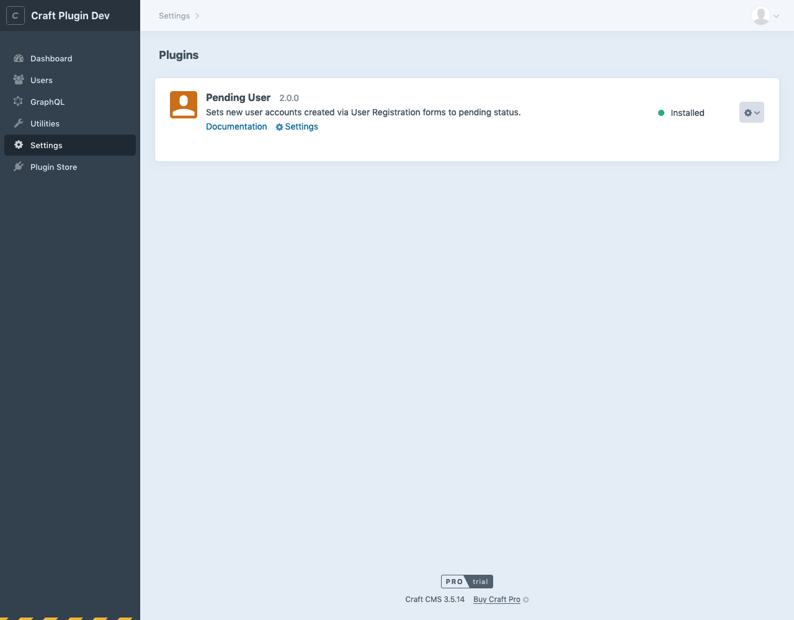

# Pending User plugin for Craft CMS 3.5.x

A Craft Plugin that enables user account moderation by setting new user accounts created via a [User Registration form](https://craftcms.com/docs/3.x/dev/examples/user-registration-form.html) to **Pending** status.

This plugin is a port of the Craft 2 *Pending User* plugin originally created by [Trevor Davis](https://github.com/davist11).




## Requirements

- [Craft CMS Pro](https://craftcms.com/pricing) 3.5.x or later.
- A Craft [Admin](https://craftcms.com/docs/3.x/user-management.html#admin-accounts) user account, or a non-admin account with the [**Administrate users**](https://craftcms.com/docs/3.x/user-management.html#permissions) permission enabled.

## Installation

To install the plugin, follow these instructions.

1. Open your terminal and go to your Craft project:

        cd /path/to/project

2. Then tell Composer to load the plugin:

        composer require ademers/pendinguser

3. In the Control Panel, go to **Settings** → **Plugins** and click the **Install** button for **Pending User**.

## Pending User Overview

1. When a user creates a new user account by registering via a [User Registration form](https://craftcms.com/docs/3.x/dev/examples/user-registration-form.html) and their email isn't listed in the **Allowed Domains** setting field, the plugin sets the account to **Pending** status.
2. The user receives an email stating that their new account has been created.
3. Optionally, a moderator receives an email stating that a new user account has been created.
4. Once the user account has been approved and activated by a moderator, the user receives an email stating that their account has been activated.

## Changes & Additions in the Craft 3.5.x Version

- Allowed Domains must now be entered separated by commas instead of on new lines.
- Support for multiple moderator email addresses, separated by commas.

## Configuring Pending User

### Craft Settings

1. In the Craft Control Panel, go to **Settings** -> **Users** -> **User Groups**.
2. Create a new User Group called *New users*, for example.
3. In the Craft Control Panel, go to **Settings** -> **Users** -> **Settings**.
4. Uncheck **Verify email addresses** to disable it (enabled by default).
5. Check **Allow public registration** to enable it (disabled by default).
6. Uncheck **Suspend users by default** to disabled it (disabled by default).
7. From the **Default User Group** drop-down menu, select **New users**, or the User Group you created in step 2.

### Pending User Plugin Settings

In the Craft Control Panel, go to **Settings** -> **Plugins** -> **Pending User**.

#### Allowed Domains
If you want to automatically activate user accounts with emails containing certain domain names, enter them in this field separated by commas. Optional.

#### Registration Email

This is the email sent to users when they register via a front-end registration form and create a new user account.

##### Subject

*Default*: User account created

##### Body

You have access to a Twig `{{ user }}` variable, which is a User Element.

*Default*:

```twig
Hi {{user.friendlyName}},

Your {{systemName}} user account {{user.username}} has been created and is pending activation.

You'll receive another email once we've reviewed and activated your account.
```

#### Moderator Notification Email

This is the email that is sent to the moderator when a user registers via a User Registration form, thereby creating a new user account.

##### Moderator Email Notification

If enabled, a moderator will receive an email notification when a new user registers. Supports multiple email addresses separated by commas.

*Default*: off

##### Moderator Email Addresses

Moderator email addresses.

*Default*: The site administrator's email address.

##### Subject

*Default*: User account activation request

##### Body

You have access to a Twig `{{ user }}` variable, which is a User Element. Use `{{ user.cpEditUrl }}` to insert a link to the User edit screen in the Craft Control Panel.

*Default*:
```twig
Hi Moderator,

Please visit {{user.cpEditUrl}} to review and activate the {{user.username}} user account.
```

#### Activation Email

This is the email that is sent to users when their user account is activated (i.e. a moderator changes the user account status from **Pending** to **Active**).

##### Subject

*Default*: User account activated

##### Body

*Default*:

```twig
Hi {{user.friendlyName}},

Your {{systemName}} user account {{user.username}} has been activated.
```

## Using Pending User

See [Pending User Overview](#pendinguser-overview) above.

## Pending User Roadmap

Some things to do, and ideas for potential features:

- [ ] Release it

Brought to you by [Andrea DeMers](https://andreademers.com)
